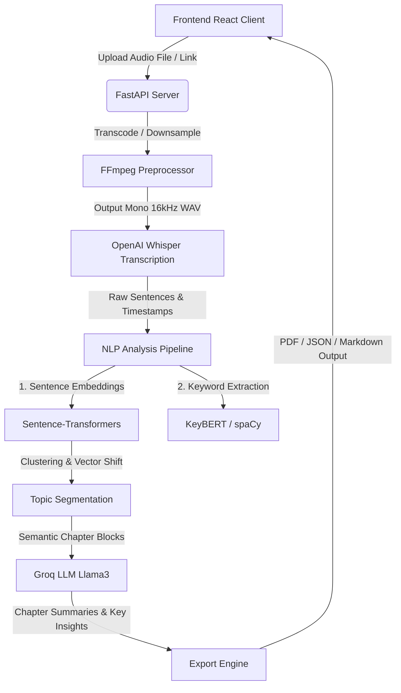

# 🎙️ Podcast AI Intelligence Platform

<p align="center">
  
</p>

<h3 align="center">Podcast AI Intelligence Platform</h3>

<p align="center">
  Transform long podcast audio files into clean, interactive transcripts, semantic chapters, and deep AI insights.
</p>

<p align="center">
  <a href="https://github.com/Anjal08/Podcast-AI-Intelligence-Platform/actions"></a>
  
  
  
  
  
  
  
  
  
  
</p>

---

## 📖 Overview

The **Podcast AI Intelligence Platform** is a state-of-the-art, commercial-grade AI software designed to digest hours of raw audio and render structured, easily readable summaries, interactive transcripts, and thematic breakdowns.

### ❓ The Problem & Why It Exists
With the explosion of long-form audio podcasts, video conferences, and webinars, consuming hours of speech has become a major time bottleneck. Searching for specific details, extracting action items, or indexing key topics is manual and inefficient. 

This platform leverages modern Speech-to-Text models (OpenAI Whisper) and Advanced Natural Language Processing (NLP) pipelines to structure audio semantically, making speech instantly searchable, conversational, and actionable.

### 👥 Who Can Use It & Real-World Use Cases
- **Content Creators & Podcasters**: Automatically generate show notes, timestamps, SEO keywords, and social summaries.
- **Researchers & Students**: Read through lecture or interview transcripts rapidly, run semantic queries, and extract direct quotes.
- **Enterprise Teams**: Turn team meetings, workshops, and product briefings into bulleted action items and indexable knowledge repositories.
- **SaaS Integrators**: Power search indexation engines with structured JSON exports representing full timeline timelines.

---

## ✨ Features

### 🎙️ Audio Processing
* **Broad Format Support**: Seamlessly ingest `.mp3`, `.wav`, `.m4a`, `.ogg`, `.flac`, and `.webm` files.
* **Drag-and-Drop Uploader**: Highly intuitive drag-and-drop dashboard supporting large file streams up to 500MB.
* **Inline Playback**: Built-in media player for monitoring and listening to source files.

### 📝 AI Transcription
* **OpenAI Whisper Engine**: Sub-word level alignment for accurate word-by-word transcription.
* **Speaker Identification**: Segments speaker blocks to distinguish conversational flows.
* **Interactive Search**: Real-time keyword filtering directly inside the transcript.
* **Time-Sync Seeking**: Clicking any transcript timestamp jumps the audio player to that exact time.

### 📚 Semantic Chapters
* **Automated Topic Segmentation**: Advanced sentence clustering algorithms divide the timeline into distinct chapters.
* **Dynamic Cards**: Collapsible cards containing localized segment summaries, keyword tags, and duration metrics.
* **Read More Toggle**: Clean summary layouts that collapse long paragraphs to maintain page readability.

### 🧠 AI Insights
* **Executive Summary**: Generates a high-level overview of the entire episode.
* **Key Takeaways & Action Items**: Bulleted key concepts and actionable next-steps for rapid comprehension.
* **Important Quotes**: Auto-extracts noteworthy quotes with accurate citations.
* **Entity Mapping**: Lists people, organizations, and technologies mentioned in the audio.

### 💬 Interactive AI Chat
* **ChatGPT-Style Assistant**: Context-aware assistant powered by LLM models that references the transcript database.
* **Suggested Prompts**: Single-click prompts to quickly index insights.
* **Markdown & Code Support**: Full markdown formatting rendering with distinct code blocks and styling.

### 📦 Enterprise Exports
* **PDF Report**: Download polished, print-ready reports with professional formatting.
* **JSON Payload**: Access raw developer payloads containing timeline vectors, keywords, and structural meta tags.
* **Markdown & TXT**: Export structured summaries ready for Obsidian, Notion, or plain text indexers.

---

## 📸 Screenshots

| Dashboard View | Transcript View |
| :---: | :---: |
|  |  |

| Semantic Chapters | AI Chat Assistant |
| :---: | :---: |
|  |  |

---

## 🛠️ Tech Stack

| Layer | Component / Tool | Details |
| :--- | :--- | :--- |
| **Frontend** | React 19, TypeScript, Vite | Fast, typed, component-driven client. |
| **Styling & UI** | Vanilla CSS, Lucide Icons, Framer Motion | Smooth 200ms transitions, premium dark layout. |
| **Backend** | FastAPI, Python 3.10 | High-performance async API backend. |
| **Speech Engine** | OpenAI Whisper | High-accuracy speech-to-text transcription. |
| **NLP Pipeline** | Sentence Transformers, KeyBERT, NLTK, spaCy | Sentence embedding extraction, keyword modeling, and topic clustering. |
| **Inference API** | Groq Llama-3 API | Low-latency inference for chat and summaries. |
| **Utilities** | FFmpeg, ReportLab | Audio transcoding and professional PDF generation. |

---

## 🏗️ System Architecture



---

## 📂 Folder Structure

```text
Podcast-AI-Intelligence-Platform/
│
├── core/                       # Core Python Backend Pipeline
│   ├── audio_loader.py         # YouTube audio downloader (yt-dlp integration)
│   ├── preprocess.py           # Audio conversion, chunking, and FFmpeg interface
│   ├── transcription.py        # OpenAI Whisper API or local model transcriber
│   ├── embeddings.py           # Sentence-Transformers vectorizer
│   ├── topic_segmentation.py   # Text tiling, topic clustering, and keyphrase extractor
│   └── exporter.py             # PDF & JSON data report builders
│
├── frontend/                   # React TypeScript SPA (Vite)
│   ├── src/
│   │   ├── api/                # API client connections (Axios endpoints)
│   │   ├── components/         # Shared components (AudioPlayer, EmptyState)
│   │   ├── contexts/           # Application state providers (Analysis, Audio, Settings)
│   │   ├── layouts/            # Page shell layouts (AppLayout, Sidebar)
│   │   ├── pages/              # View pages (Dashboard, Transcript, Chapters, Chat, Exports)
│   │   ├── types/              # TypeScript interface definitions
│   │   ├── utils/              # Formatter and array helpers
│   │   ├── App.tsx             # Main router routing setup
│   │   ├── index.css           # Global premium dark theme CSS configuration
│   │   └── main.tsx            # Application mounting file
│   ├── package.json            # Frontend package scripts and dependencies
│   └── vite.config.ts          # Vite bundling settings
│
├── outputs/                    # Exported PDFs and JSON datasets
├── temp_uploads/               # Temporary uploads storage directory
├── main.py                     # API launch configuration (FastAPI server)
├── app.py                      # Deprecated Streamlit setup (Alternative UI)
├── requirements.txt            # Python environment packages
└── README.md                   # System documentation
```

---

## ⚙️ Installation & Setup

### Prerequisites
- **Python 3.9 or higher**
- **Node.js v18 or higher**
- **FFmpeg** installed and added to your System PATH variables.

### 1. Clone the Repository
```bash
git clone https://github.com/Anjal08/Podcast-AI-Intelligence-Platform.git
cd Podcast-AI-Intelligence-Platform
```

### 2. Backend Setup
1. Create and activate a Python virtual environment:
   ```bash
   python -m venv venv
   # Windows
   venv\Scripts\activate
   # macOS/Linux
   source venv/bin/activate
   ```
2. Install the backend Python packages:
   ```bash
   pip install -r requirements.txt
   ```
3. Set up your `.env` configuration file (see [Environment Variables](#environment-variables) below).
4. Launch the FastAPI server:
   ```bash
   python main.py
   ```
   The backend will run on `http://localhost:8000`.

### 3. Frontend Setup
1. Open a new terminal window and navigate to the frontend directory:
   ```bash
   cd frontend
   ```
2. Install npm dependencies:
   ```bash
   npm install
   ```
3. Launch the Vite development server:
   ```bash
   npm run dev
   ```
   The application will be accessible at `http://localhost:5173`.

---

## 🔑 Environment Variables

Create a file named `.env` in the root workspace directory matching the variables in this `.env.example`:

```env
# Server Configuration
HOST=127.0.0.1
PORT=8000

# API Credentials
GROQ_API_KEY=gsk_your_groq_api_key_goes_here

# Paths Configuration
UPLOAD_FOLDER=temp_uploads
OUTPUT_FOLDER=outputs

# Processing Configuration
MODEL_NAME=sentence-transformers/all-MiniLM-L6-v2
```

---

## 📡 API Endpoints

FastAPI exposes the following swagger endpoints. Documentations can be viewed live at `http://localhost:8000/docs`.

| Method | Endpoint | Description |
| :--- | :--- | :--- |
| **POST** | `/api/analyze` | Accepts multipart form data audio file, creates analytical task. |
| **GET** | `/api/status/{task_id}` | Polls processing stage index, progress logs, and final transcript results. |
| **POST** | `/api/chat/{task_id}` | Processes conversational chat queries relative to transcript context. |
| **GET** | `/api/download/pdf/{task_id}` | Downloads compiled executive report and transcript timeline as PDF. |
| **GET** | `/api/download/json/{task_id}` | Exports vector-processed JSON metadata. |
| **GET** | `/api/health` | Returns backend online connection and service checks. |

---

## ⚙️ How It Works (The AI Pipeline)

The system transforms raw audio into semantic chapters through an automated multi-step computational pipeline:

```
[Audio Upload] ──> [FFmpeg Preprocess] ──> [Whisper AI Transcription] ──> [Sentence Tokenization]
                                                                                   │
                                                                                   ▼
[PDF/JSON Export] <── [Groq LLM Synthesis] <── [Topic Segmentation] <── [Vector Embeddings]
```

1. **Upload & Preprocessing**: Audio is sent to the backend where FFmpeg normalizes the signal to a mono 16kHz WAV format (the optimal rate for Speech-to-Text).
2. **Transcription (Whisper)**: OpenAI's Whisper engine parses audio frames, yielding sentences, words, speaker segments, and millisecond timestamps.
3. **Sentence Embeddings**: Tokenized sentences are converted into high-dimensional vector representations using `Sentence-Transformers`.
4. **Semantic Clustering**: The system calculates cosine similarity shifts between consecutive sentences to identify "boundaries" where topics drift, segmenting the timeline into logical chapters.
5. **Insights Generation**: Segment blocks and relevant keywords are synthesized by Llama-3 models via Groq API, producing clean chapter names, takeaways, action items, and summaries.

---

## 📈 Performance
- **Low-Latency Inference**: Integrates Groq Llama-3 processing to generate AI highlights and summaries in milliseconds.
- **Efficient UI Rendering**: Optimized React layout structures with clean states preventing unnecessary renders.
- **Fast Transcription**: Optimized audio chunking pipelines feeding Whisper engines cleanly.

---

## 🔮 Future Improvements
- [ ] **Speaker Diarization**: Integrate PyAnnote to tag speaker voices with custom speaker names automatically.
- [ ] **Vector Database**: Integrate Qdrant or Milvus to search across multiple historic podcasts semantically.
- [ ] **Multi-language Support**: Transcribe non-English podcasts and auto-translate outputs.
- [ ] **User Authentication**: Add secure login layers, session keys, and persistent user profile accounts.
- [ ] **Live Audio Recording**: Transcribe and analyze microphone inputs in real-time.

---

## 🚀 Deployment

### Frontend (Vercel)
1. Install Vercel CLI or link your repository to [Vercel](https://vercel.com).
2. Set the build command to `npm run build` and output folder to `dist`.
3. Set the environment variable `VITE_BACKEND_URL` to point to your live hosted FastAPI address.

### Backend (Render)
1. Create a new Web Service on [Render](https://render.com).
2. Use Python environment, set build command to `pip install -r requirements.txt`, and start command to `uvicorn main:app --host 0.0.0.0 --port $PORT`.
3. Add the `GROQ_API_KEY` to the environment settings.
4. Ensure Render has system FFmpeg binaries loaded (via custom Docker builds if using default templates).

---

## 🤝 Contributing

Contributions make the open-source community an amazing place to learn, inspire, and create.
1. Fork the project.
2. Create your feature branch (`git checkout -b feature/AmazingFeature`).
3. Commit your changes (`git commit -m 'Add some AmazingFeature'`).
4. Push to the branch (`git push origin feature/AmazingFeature`).
5. Open a Pull Request.

---

## 📄 License

Distributed under the MIT License. See [LICENSE](LICENSE) for more information.

---

## ✍️ Author

**Anjali Patel**
* GitHub: [@Anjal08](https://github.com/Anjal08)
* Specialization: AI, NLP & Full-Stack Development

---

## 🙏 Acknowledgements
- [OpenAI Whisper](https://github.com/openai/whisper)
- [FastAPI Framework](https://fastapi.tiangolo.com)
- [Groq AI Engine](https://groq.com)
- [Sentence Transformers](https://sbert.net)
- [KeyBERT](https://github.com/maartengr/KeyBERT)
- [React & Vite Ecosystem](https://vite.dev)
